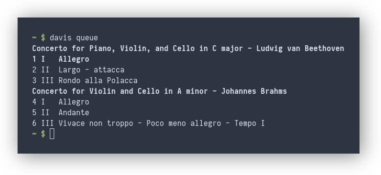

# Davis

[](https://repology.org/project/davis/versions)

Davis is a [MPD](https://www.musicpd.org/) client for music lovers.

## Features

### Davis displays detailed metadata

Davis displays any metadata you like! The performers, conductor, ensemble,
work, movement, recording location, etc., can all be displayed so long as it's
in your tags:


### Davis supports album art

Davis can fetch album art directly from MPD, using the `albumart` command of
the MPD protocol. This means that davis can fetch album art even from remote
MPD instances, and does not need to know the location of your music directory.
With a custom subcommand (here [`davis-cur`](subcommands/cur/)), it is also
possible to display the album art as sixel graphics in the terminal:


### Davis understands classical music

Davis will group your queue by work, and displays movement tags instead of title:


### Custom subcommands

Davis can be extended with custom subcommands (here [`davis-fzf`](subcommands/fzf/)):


See the [manual](MANUAL.txt) for details on how to add new subcommands.

## Installing

### Arch Linux

#### From AUR

Install [davis](https://aur.archlinux.org/packages/davis) AUR package.

#### From PolarRepo (prebuilt package)

Add the PolarRepo repository to `/etc/pacman.conf`

```
[polarrepo]
Server = https://polarrepo.polarian.dev/
```

You will then need to import Polarian's GPG key to be able to verify the
package signature:

`pacman-key --recv-keys 0770E5312238C760`

The owner of this key is `Polarian <polarian@polarian.dev`, otherwise it
is invalid and should not be imported.

You then need to locally sign the key, this tells pacman that the key is
trusted and the package should be allowed to be installed.

`pacman-key --lsign-key 0770E5312238C760`

You can then install `davis` using the pacman package manager as any
other package, using the following command:

`pacman -Syu davis`

Davis will be updated to the latest version every time `pacman -Syu` is
called.

For more information see
[PolarRepo](https://onedev.polarian.dev/polarrepo).

### Generic Installation

You will need a rust toolchain. To install, you run

```sh
cargo install davis
```

### Shell completions

Shell completion (tab-complete) is available in `/completions`. Only bash is
currently supported, but PRs for other shells are very welcome!
