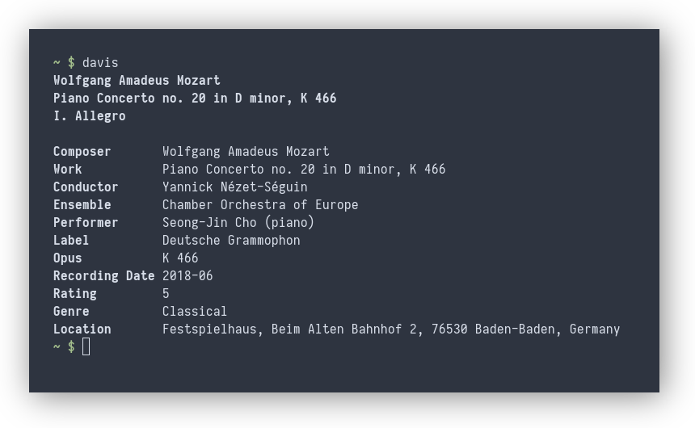
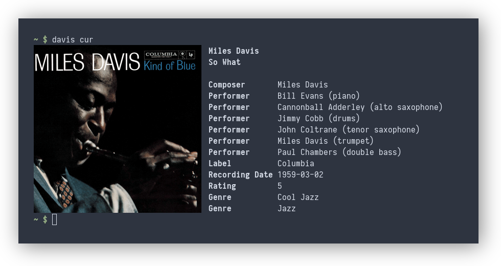

# Davis

Davis is a [MPD](https://www.musicpd.org/) client for music lovers.

### Davis displays detailed metadata:
Davis displays any metadata you like! The performers, conductor, ensemble,
work, movement, recording location, etc., can all be displayed so long as it's
in your tags:

### Davis supports album art
Davis can fetch album art directly from MPD, using the `albumart` command of
the MPD protocol. This means that davis can fetch album art even from remote
MPD instances, and does not need to know the location of your music directory.
With a custom subcommand (here [`davis-cur`](subcommands/cur/)), it is also
possible to display the album art as sixel graphics in the terminal:

### Custom subcommands
Davis can be extended with custom subcommands (here [`davis-fzf`](subcommands/fzf/)):

See the [manual](MANUAL.txt) for details on how to add new subcommands.
